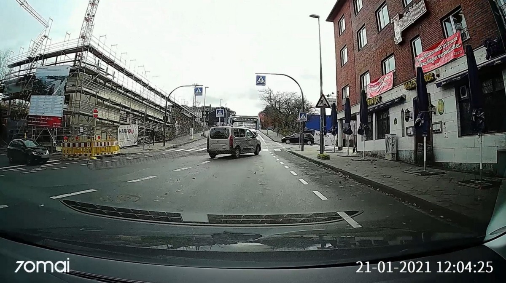
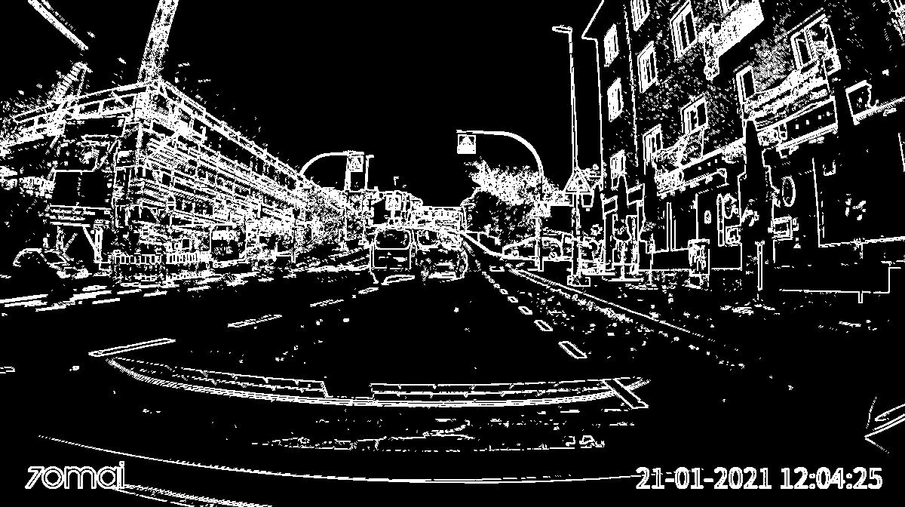
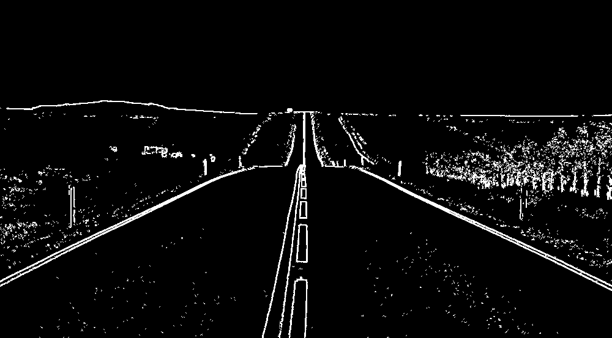
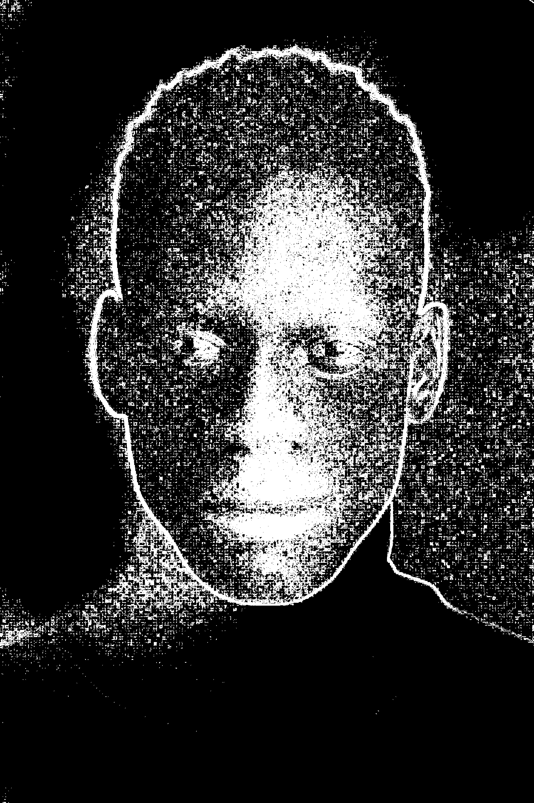

# Simple Edge Detection
***

### How it works
The program loops through all the pixels in a grayscaled image and depending on the difference in color from it's
surrounding pixels it will turn white.
***
### Examples
| Reference Image | Product |
|-----------------|---------|
|  |  |
|  |  |
|  |  |
|  |  |
| This one didn't work well but it looks cool    |  |
